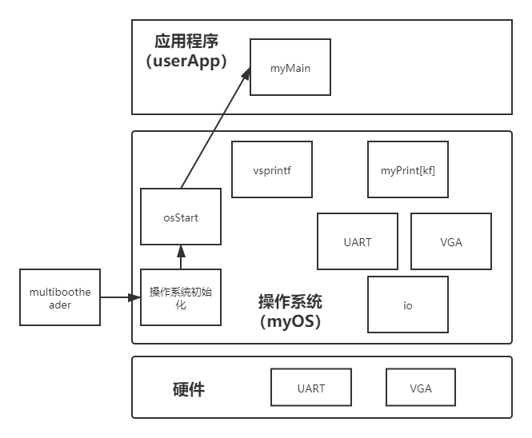
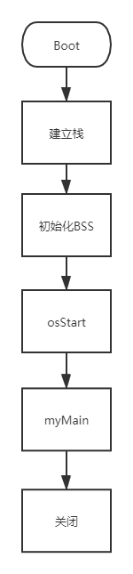
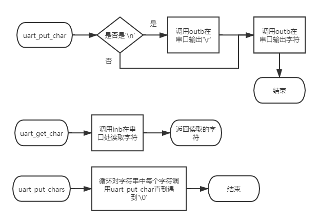
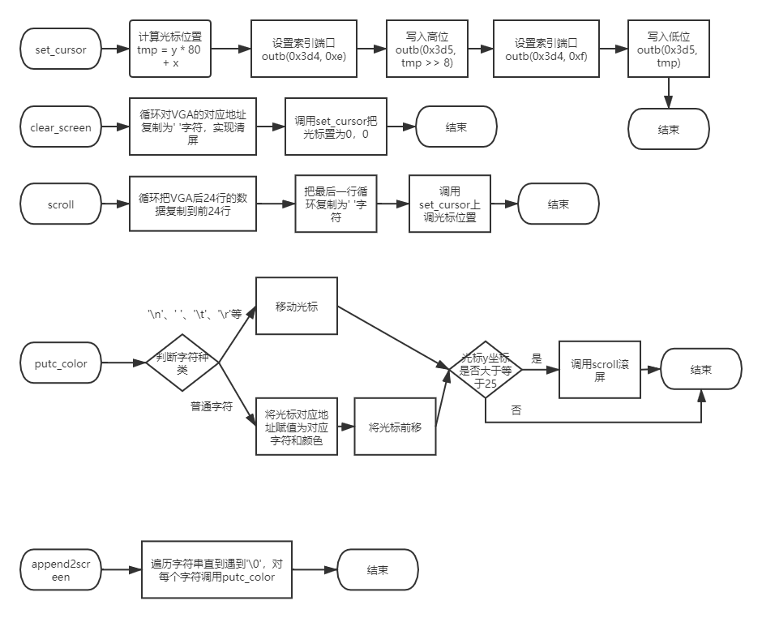
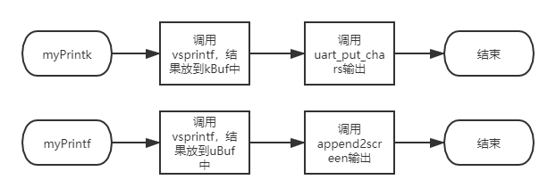

# 实验二：multiboot2myMain

PB18061414 郭宇韬

----

## 操作系统框图及概述



操作系统以 multiboot 协议启动，做好了建立堆栈等初始化工作，为上层应用（userApp）提供了必要的运行环境，并通过与底层硬件（VGA、UART）交互为上层应用提供了myPrint[kf] 等函数。

----

## 主流程及其实现



操作系统首通过 multiboot 协议启动，为运行 c 语言编译的程序建立了一个堆栈，并初始化了 BSS 段（用于放置静态变量），之后转到 osStart （此处开始以 c 语言来实现，此前均为汇编语言），osStart 会打印一些提示信息并调用用户主程序 myMain，执行结束后（实际上之后会进入一个死循环，不会运行到 shut_down）操作系统运行完毕。

----

## 主要功能模块及其实现

### 端口输入输出 `inb` 和 `outb`

使用嵌入式汇编在 c 语言程序中插入汇编语言，直接使用汇编语言中的指令来实现。

### UART 相关函数



补充说明：

基本上都是直接在 UART 端口调用 `inb` 或 `outb` 来实现，但是 `uart_put_char` 在遇到 '\n' 时会额外打印一个 '\r',这是为了在 qemu 的串口界面得到正确的输出（否则会有偏移），如果直接在终端输出可能并不需要。

### VGA 相关函数



补充说明：

对内存数据的修改是通过指针来实现的，例如（其中 `VGA_BASE` 是个指针）：

```c
for (y = 0; y < 25; y++){
    for (x = 0; x < 80; x++){
        VGA_BASE[y*80 + x] = blank;
    }
}
```

`set_cursor`：使用 `outb`，对 VGA 相关端口写入数据来修改光标位置。并将光标位置保存在一个全局变量中来避免重复读取。

`scroll`：对数据的复制是通过循环将对应地址的数据复制到另一个地址来实现的，实际上还实现了 `memcpy`、`memsetw` 等辅助函数。

### 打印相关函数

`vsprintf`：移植自 linux，并自行用指针实现了 `va_list`、`va_arg` 等需要的宏。

`myPrint[kf]`：



## 源代码说明

## 代码布局空间说明

## 编译过程说明

## 运行和运行结果说明  
